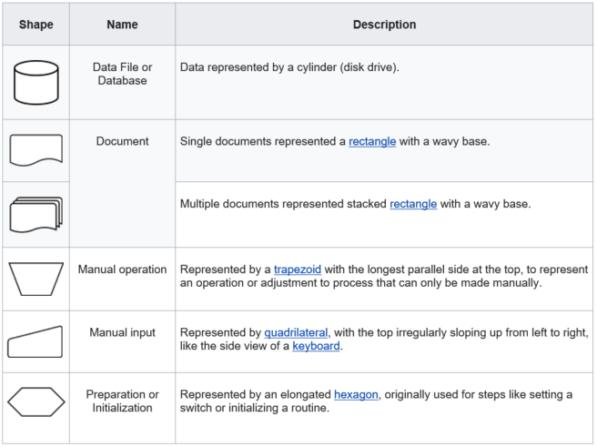

# Toward Best Practices to Develop, Reuse, and Share Code

For information on the DCAN Labs standards for writing code, please visit [hackmd](https://medium.com/markdown-monster-blog/getting-images-into-markdown-documents-and-weblog-posts-with-markdown-monster-9ec6f353d8ec).

## **The Typical Workflow**

- A researcher starts with an idea
- The researcher develops a working prototype that works and leads to cool results
- Then someone else asks to use the code

### Challenges

- Code is not fully developed/bullet proofed.
- Poor documentation
- Hard-coded paths
- Not designed to be re-used

### In an Ideal World

- Code should be fully documented
  - Including description
  - Example
  - Data
- Should be able to run on any platform
- Code should be modularized
- Modular elements should be able to be reused
- Final code should be containerized

## **The New Workflow**

- Describe the goal of the project
- Define inputs and outputs
- Make a diagram as granular as possible
- Reuse existing components

### Components

Key elements are listed. In parenthesis it is also indicated a suggested color coding schema for flow diagrams.

- **Code base (Black)**. Code developed and maintained by external users or by a member of the DCAN labs. Each code base should have a steward1 that will make sure the code is kept under version control, updated, that issues and features requests are properly managed. Steward should also make sure compatibility is preserved for all the applications that use each code base.
  - Language: This could be bash, matlab, python, R, etc
  - Inputs
    - Numerical matrices
    - Tables with demographics, covariates
  - Outputs
    - Numerical matrices
    - Tables
  - Settings
    - Different ways to run the code
- **Interfaces (Orange outline)**.  These are a set of tools that can reshape-reformat neuroimaging or demographics data to be used by any code base. There are also interfaces to convert back matrices to neuroimaging data.
  - Neuroimaging to numerical matrices
  - Numerical matrices to neuroimaging data
  - Standard ways to read demographics
- **Visualizers (Purple outline)**. Those are packages able to take standardly formatted demographic and neuroimaging data and make high-quality figures
- **Markdown-formatters (Blue outline)**. Code to take tables and make markdown files

1CodeStewardship is an alternative to CodeOwnership, emphasizing that code is the team's property, and not the sole province of any one person. A team member is granted stewardship over a piece of code. The steward has primary responsibility for the code's "care and feeding," with input and guidance from the community. The steward normally makes all changes to the code, though trusted members of the team may make changes that the steward is then responsible for vetting. For more information. visit [Code Stewardship](https://wiki.c2.com/?CodeStewardship#:~:text=The%20steward%20has%20primary%20responsibility,is%20then%20responsible%20for%20vetting).

## **Case Example**

We like to use community detection to identify individualized ROIs given a connectivity matrix. While there is code to do it, we can not use the code as is in another system for several reasons.

## Proposed Elements for Flow Diagrams

The [American National Standards Institute](https://en.wikipedia.org/wiki/American_National_Standards_Institute) (ANSI) set standards for flowcharts and their symbols in the 1960s.The International Organization for Standardization (ISO) adopted the ANSI symbols in 1970. The current standard, ISO 5807, was revised in 1985. Generally, flowcharts flow from top to bottom and left to right. [Reference](https://en.wikipedia.org/wiki/Flowchart#cite_note-IBM1970-17)

[[14]](https://en.wikipedia.org/wiki/Flowchart#cite_note-ShellyVermaat2011-14) [[15]](https://en.wikipedia.org/wiki/Flowchart#cite_note-Myler1998-15)

### Other Symbols

The ANSI/ISO standards include symbols beyond basic shapes. Some are:

## **Process for Implementing the Workflow**

- Agree on the proposal
- Use a standard dictionary to define variables,
- Robustify existing components
- Have code under version control
- Work on documentation

### Resources for Creating Visual Diagrams

*Note: some of these resources have a limit on the number of documents allowed before a subscription is required.*

[Lucidchart](https://www.lucidchart.com/pages/landing?utm_source=google&utm_medium=cpc&utm_campaign=_en_us_mixed_search_brand_exact_&km_CPC_CampaignId=1457964857&km_CPC_AdGroupID=57044764032&km_CPC_Keyword=lucidchart&km_CPC_MatchType=e&km_CPC_ExtensionID=&km_CPC_Network=g&km_CPC_AdPosition=&km_CPC_Creative=442433231228&km_CPC_TargetID=kwd-33511936169&km_CPC_Country=9019676&km_CPC_Device=c&km_CPC_placement=&km_CPC_target=&mkwid=slSsrWCiw_pcrid_442433231228_pkw_lucidchart_pmt_e_pdv_c_slid__pgrid_57044764032_ptaid_kwd-33511936169_&gclid=Cj0KCQjw--GFBhDeARIsACH_kdYJohKZV63GiUV9Nn7s16hH9cmc-05ZJtz8BMtMmG70pAu13sk6j0MaAlSzEALw_wcB)

[Draw.io](https://apps.diagram.net/)

[PlantUML](https://plantuml.com/)

[Creately](https://creately.com/)

[Cacoo](https://cacoo.com/?utm_source=adwords&utm_medium=cpc&utm_campaign=brand_e&utm_term=cacoo&gclid=Cj0KCQjw--GFBhDeARIsACH_kdYzaP77AOmqvAX4KySgUghh9gujuvsEo4MMpl993wSHx7BZdkncqGgaAothEALw_wcB)

[Miro](https://miro.com/?utm_source%3Dgoogle%26utm_medium%3Dcpc%26utm_campaign%3DS|GOO|BRN|US|EN-EN|Brand|Exact%26utm_adgroup=%26utm_custom%3D10028209663%26utm_content%3D434602393898%26utm_term%3Dmiro%26matchtype=e%26device=c%26location=9019676&gclid=Cj0KCQjw--GFBhDeARIsACH_kdZGGaEvdoV3ri3pH95nOoJgsULnJHl2RfNIRzPbqSGsAP_TqQPxrakaAhp3EALw_wcB)
