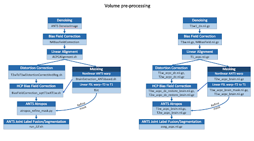
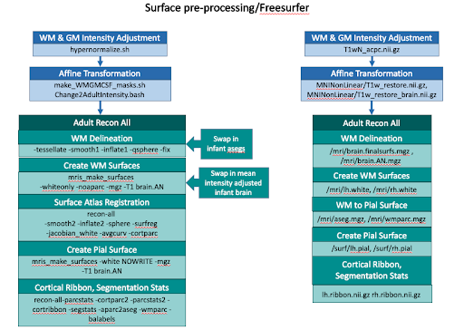
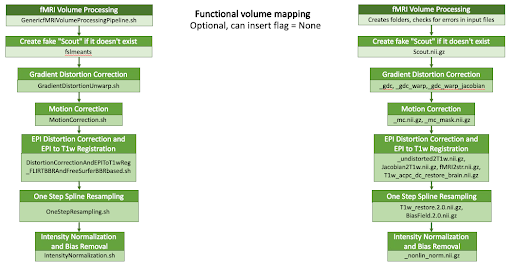
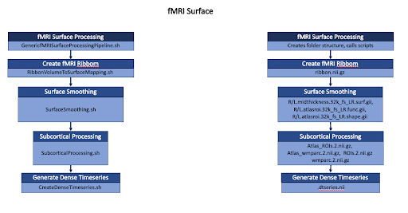
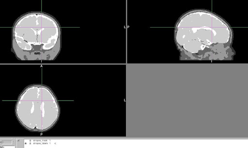
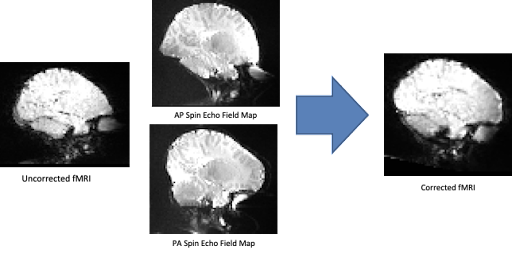
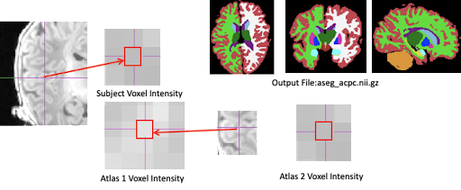

# Infant Pipeline Documentation


### GitHub Repositories and Code Bases

**BIDS App* for DCAN Infant Pipeline (infant-abcd-bids-pipeline):** [https://github.com/DCAN-Labs/infant-abcd-bids-pipeline/tree/master/app](https://github.com/DCAN-Labs/infant-abcd-bids-pipeline/tree/master/app)

*a "BIDS App" is a portable neuroimaging pipeline that understands BIDS dataset). This software takes a BIDS folder as input, determines parameters to be used, and runs the dcan lab's modified hcp pipeline for infants.

** \
DCAN Infant Pipeline Code (dcan-infant-pipeline):**

[https://github.com/DCAN-Labs/dcan-infant-pipeline](https://github.com/DCAN-Labs/dcan-infant-pipeline)


### Pipeline Description:

Written by Mollie Marr

_A brief overview of the Human Connectome Pipeline (adapted for DCAN’s infant pipeline)._

The HCP functional MRI pipeline is comprised of five stages.The first stage, PreFreesurfer, takes a set of anatomical T1w and T2w raw structural images, restores the anatomical images and registers them to the MNI152 atlas. Freesurfer segments subcortical structures, reconstructs native surfaces from the normalized structural data, and registers the surfaces to the MNI atlas surface in a point-to-point mapping. PostFreeSurfer converts restored volumes native surfaces into HCP-compatible format (i.e. CIFTIs), and transforms the surfaces geometrically into atlas space. The Volume stage registers the functional data to the standard template through the restored anatomical data. The Surface stage projects the functional data onto the template-space surfaces.

Our modifications to this pipeline alter the above steps for effectiveness, organization, and flexibility, and also add three stages to this process: 1) functional connectivity pre-processing (DCANBOLDproc) 2) standard outputs for quality control (ExecutiveSummary) and 3) custom post-processing file removal (CustomClean).  Here we outline the changes to each stage and additional stages in order.

**Anatomical Preprocessing Modifications to HCP**

The HCP PreFreeSurfer stage takes a set of anatomical T1-weighted and T2-weighted raw images, with an optional field map, and computes several features: a linear transform to the standard template (each), a brain-ROI mask, relevant image restoration, and a nonlinear registration to the standard template using FSL FNIRT. As this is the first stage, any small errors in extracting these features can cause unexpected problems in downstream preprocessing stages. In comparison of results across scanner platforms, we found inconsistencies in the computation of the brain mask, as well as the restoration of the anatomical images, particularly from sites with GE scanners. The brain extraction process can leave excessive nasal and ocular tissue remaining in the ROI, and the bias field restoration can be insufficient, which can negatively impact surface reconstruction and nonlinear registration.

To address this, we add two additional image restoration techniques prior to PreFreeSurfer, ANTs DenoiseImage, which models scanner noise as a Rician distribution, and ANTs N4BiasFieldCorrection, which attempts to smooth relative image histograms in different regions of the brain. The addition of these two steps improves preprocessing consistency over the ABIDE dataset as well as data collected from GE scanners. Additionally, we modified the pipeline to permit an optional T2w image, allowing legacy datasets to be processed.

The HCP FreeSurfer stage is kept identical in function, performing semantic segmentation of brain structures, reconstruction of the white/gray matter surface boundary and the gray matter/pial surface boundary, and surface registration using surface feature maps. The additional HCP process of improving gray matter/pial surface estimates by using the T2 weighted image is made optional based on the presence of a T2w image.

To optimize the HCP pipeline for use in infant populations several key changes were made. In the following sections we describe the specific modifications made to each stage of the original HCP pipeline: Pre-freesurfer, Free surfer, and Post-freesurfer. We also add two additional sections entitled DCAN Preproc and Executive Summary.  

**Pre-Freesurfer Modifications**





The main outputs from the Pre-Freesurfer stage are the subject brain registered to atlas space and segmentations. Because little space exists between the infant brain and skull, several key modifications were made to this pipeline to optimize brain extraction and registration.  We first denoise the anatomical images using ANTs denoising, average like-modality scans together, and perform ANTs N4 bias field correction. We then use a head-to-head rigid body transform to ACPC-align both T1w and T2w structural images to the NIH pediatric template, resulting in native volume space images. Brain extraction is performed by binarizing the MNI infant brain atlas and nonlinearly warping it to the T2w structural image using a transformational matrix generated based on the warp from the MNI atlas head to the T2w subject head. The resulting T2w brain mask is then linearly warped to the T1w brain. The output of this process is the initial skull-stripped T1w and T2w infant brain in native volume space.

The spin echo field maps collected in both the anterior-posterior and posterior-anterior direction are then used to distortion correct our structural images by removing inhomogeneity. Our distortion corrected images in atlas space are now bias field corrected again using the HCP Bias Field correction algorithm, which allows for intensities across the brain to become more homogenous. We refine our extracted brains by computing tissue classes in the T2w brain and applying these to the T1w brain using the ANTS Atropos algorithm. Since the brain is made up of high intensity tissue classes, this intersects with the previously generated brain masks to refine brain extraction. The T1w and T2w are then nonlinearly registered to the MNI infant atlas in order to obtain a more refined registration. Lastly, the brain is segmented into distinct regions using the 10 automatically segmented, and subsequently manually corrected, infant atlases with labeled brain regions. Each atlas is nonlinearly registered to the subject T1w or T2w image depending on which is chosen (the T1w image was used for UCI processing), then the ANTS Joint Label Fusion algorithm is used to compute the local cross correlations between voxel intensities in the subject and each atlas. Each atlas then “votes” on how each voxel kernel in the subject brain should be labeled, based on how correlated the intensities between each voxel kernel in the subject and atlas are in a given brain region.

**Freesurfer Modifications**




The mean intensity of the resulting white and grey matter labels are adjusted to match the Freesurfer adult atlas. This hypernormalization procedure improves grey and white matter segmentations in infants and allows us to use HCP’s FreeSurfer Recon all to generate surfaces in the infant brain.

Two key modifications have been made to the HCP Freesurfer stage, namely the use of our mean intensity adjusted infant brain and our own aseg. We use Freesurfer’s original recon all procedure to create surfaces based off of the mean intensity adjusted white and grey matter segmentations of our infant brain, hypernormalized to match adults. The white matter surface is delineated using a gradient descent algorithm that looks for borders between the white and grey matter in the mean intensity adjusted infant segmented brain. Once these are identified, the white matter mesh is extracted, and inflated out to the pial boundary (grey matter surface) to calculate the midthickness.  

**Post Freesurfer Modifications**

The PostFreesurfer stage converts freesurfer outputs into the standard CIFTI space. Modifications to this stage better harmonize the reconstructed surfaces and corresponding metrics. As discussed in 1) PreFreesurfer, nonlinear registration to the standard MNI atlas is computed using the refined brain mask acquired through 2) Freesurfer. This brain mask, now refined by the reconstructed surfaces, provides better alignment to the standard template than the preliminary mask used in 1) PreFreesurfer. Additionally, the ANTS compressible fluid deformation algorithm performs the nonlinear registration instead of the FNIRT elastic deformation algorithm. A previous comparison of over 12 registration methods across multiple datasets show that ANTs consistently outperforms FNIRT on every performance metric.

**BOLD Modifications**

_Functional volume mapping (Vol) changes_






Only one modification was made to the functional mapping (“vol” and “surf”) stages of the HCP pipeline, where functional data are projected onto the standard template and converted to CIFTI format. The unmodified HCP pipeline required the use of reverse phase spin-echo or gradient field maps in order to complete the functional mapping. Such images are used to correct distortions produced when acquiring fMRI data. While such distortion correction is considered best practice in modern fMRI studies, the modified HCP pipeline includes a “no distortion correction” approach, when no such data is acquired. Such an approach is a necessity for some large legacy datasets (e.g. ABIDE). Like most fMRI studies, the pipeline performs slice timing correction, mode 1000 normalization and frame-frame realignment at this stage. Framewise displacement measures (FD), are used in the DCAN preproc stage below to help control for the motion artifact.

_DCAN Preproc_

We include a new module to the HCP pipeline, termed “DCAN Preproc”. This module performs functional connectivity preprocessing on rest fMRI scans only. Since the discovery of the motion artifact by multiple independent labs, many researchers conducted studies to determine the best standards and practices for quality assessment of functional connectivity data. This module attempts to incorporate such standards here (DCAN Preproc Figure 1) and involves four broad steps: 1) standard preprocessing, 2) motion censoring followed by standard reprocessing, and 3) construction of parcellated timeseries.  

 1. Standard preprocessing

Standard preprocessing comprises three steps. First all fMRI data are demeaned and detrended with respect to time. Next a general linear model is used to denoise the processed fMRI data. Denoising regressors comprise signal and movement variables. Signal variables comprise mean time series and first derivative for white matter, CSF, and the global signal, which are derived from Individualized segmentations generated during 3) PostFreesurfer. Movement variables comprise translational (X,Y,Z) and rotational (roll, pitch, and yaw) measures estimated by realignment during _VOL_ and their Volterra expansion. These regressors represent the best approach to denoising currently studied. In particular, the inclusion of GSR is critical for most resting-state functional MRI comparisons, as demonstrated empirically by multiple independent labs. After denoising the fMRI data, the timeseries are bandpass filtered between 0.008 and 0.09 Hz using a 2<sup>nd</sup> order butterworth filter. Such a bandpass filter is softer than other filters, and avoids potential aliasing of the timeseries signal. 

2. Motion censoring

Our motion censoring procedure follows the most recent studies on eliminating the motion artifact in resting state functional MRI data. Our motion censoring procedure is used both as part of the standard preprocessing, and also for the final construction of parcellated time series. Framewise displacement is calculated as the squared sum of all the motion vectors estimated during frame-frame alignment. For standard preprocessing, data are labeled as “bad” frames if they exceed and FD of 0.3. These “bad” frames are removed when demeaning and detrending, and betas for the denoising are calculated using only the “good” frames. For bandpass filtering, interpolation is used initially to replace the “bad” frames, and the residuals are extracted from the denoising GLM. In such a way, standard preprocessing of the timeseries only uses the “good” data but avoids potential aliasing due to missing timepoints. When extracting timeseries for data analysis, only data with an FD of  0.3 are extracted.

3. Generation of parcellated timeseries for specific atlases

Using the processed resting state fMRI data, the modified pipeline constructs parcellated timeseries for predefined atlases, making it easy to construct correlation matrices or perform timeseries analysis on putative brain areas defined by independent datasets. The atlases comprise recent parcellations of brain regions that comprise different networks. In particular, parcellated timeseries are extracted for Evan Gordon’s 333 ROI atlas template, Jonathan Power’s 264 ROI atlas template, Thomas Yeo’s 118 ROI atlas template, and the HCP’s 360 ROI atlas template. Since we anticipate newer parcellated atlases as data acquisition, analytic techniques, and knowledge all improve, it is trivial to add new templates for this final stage.

_Executive Summary _

Unlike volume-based pipelines, surface-based pipelines do not have metrics that enable simple quality control (QC; also known as quality assurance/QA) to exclude participants. Though efforts are ongoing to construct QC metrics and automated approaches to determining the quality of outputs, visual inspection of HCP outputs is critical to ensure that analyses are not contaminated by poor reconstructions, artefactual fMRI data, and improper registration. Because such outputs are visualized in multiple ways that require multiple programs, our pipeline produces an integrated, web-based executive summary, which enables visual inspection of most relevant outputs within a simple web browser. This executive summary enables one to view surfaces overlaid on MRI anatomical data (e.g. T1/T2), anatomical/functional and anatomical/anatomical overlays, and timeseries greyplots of fMRI data.<span style="text-decoration:underline;"> </span> 

Produce two brainsprite images for web-based visualization 

Surfaces on T1w 

Visual inspection of surfaces on MRI volumes is time-consuming but necessary to determine whether white (i.e. defined by the grey/white border) and pial (defined by the grey/CSF border) surfaces appropriately delineate the cortical ribbon. Surfaces are overlaid on T1 weighted MRI volumetric data. Because such data are volumetric, only a single 2-dimensional slice can be visualized per image. Therefore, we converted surface/MRI overlays into a series of gif snapshots for coronal, sagittal, and axial views. Using brainsprite, we assembled these snapshots into three connected views. Through brainsprite, the user can easily cycle through volumetric slices to assess the quality of delineated pial and white surfaces. These visualizations capture the same information as found in the excellent VisualQC package. 

Surfaces on T2w 

If a given user includes T2 weighed MRI data, additional brainsprite images will be produced for the pial and white surfaces overlaid on the T2 volume. Such visualizations can serve as a secondary check on surface quality, because the T2 contrast is better suited to assessing the quality of surfaces along inferior frontal and mesial temporal lobe cortex.  

Produce rest outlined on T1 and vice-versa to check FOV and functional to anatomical registration 

Within subject functional/anatomical registration can be inspected via anatomical/functional overlays. Specifically, selected coronal, sagittal and axial slices of anatomical MRI data are displayed with the edges of the functional data overlaid on top as a red line drawing and vice versa. Such visualizations are similar to those found in summary reports from FSL, which are used to assess the quality of within-subject functional registration. 

Produce atlas outlined on T1 and vice-versa to check atlas registration 

Similarly, atlas-based anatomical registration can be checked via anatomical/anatomical overlays. Here, selected coronal, sagittal, and axial slices of the subject’s atlas transformed T1 weighted images are displayed with the edges of the atlas T1 images overlaid on top as a red line drawing and vice versa. These visualizations can help assess the quality of atlas registration. 

Produce greyplots for visualization of resting state data quality 

Identification of fMRI artifacts, such as motion induced artifact, benefit greatly from greyplot visualizations. Such visualizations were pioneered by the Schlaggar/Petersen labs at Washington University in St. Louis. The functional MRI data is plotted as an indexed plot of greyscale voxels. Each voxel is plotted along the y-axis, while each timepoint is plotted along the x-axis. The intensity of each voxel represents its value at a given timepoint. Above the graph, motion parameters, DVARS, and signal variance are plotted with respect to time. Below the graph, FD is plotted, and lines denote cutoffs for different thresholds. As a result, users can quickly scan this graph and determine the amount of high-quality fMRI data is available from each fMRI session.   

Produce concatenated resting-state greyplot, excluding any task runs 

Although we show both task and non-task greyplots for individual runs, greyplots are more critical for evaluating the quality of resting state fMRI data than task data. Therefore, we also show a concatenated greyplot across all rest runs and exclude any task-based fMRI data from this concatenation. Such a plot enables the user to quickly assess the amount of high-quality data across all resting state scans. 


### Pipeline Optional Flags and Example:

**Optional flag: feed in externally generated segmentation to FreeSurfer**


```
--aseg PATH
Default: aseg generated by PreFreeSurfer
```


The pipeline normally will use joint label fusion to generate a segmentation file as the last step of PreFreeSurfer. However, if you already have a segmentation file (eg a file matching _/files/T1w/aseg_acpc.nii.gz_ in the pipeline outputs) generated prior to running the pipeline that you would prefer to use, you can provide the path to this file to the _--aseg_ flag and the pipeline will use this external file for FreeSurfer. The pipeline in this case will skip JLF and copy the external file into the pipeline outputs to generate the _/files/T1w/aseg_acpc.nii.gz _file. 

FreeSurfer uses the externally provided path to the aseg instead of referencing the PreFreeSurfer outputs. If you ran PreFreeSurfer without providing an external aseg and restart the pipeline at FreeSurfer with an external aseg, it will not copy the external segmentation into the PreFreeSurfer directory to overwrite the _/files/T1w/aseg_acpc.nii.gz _file formerly created by joint label fusion.

Finally, remember that the external aseg must be mounted in order for Docker/Singularity to use it (using the `--bind/-B `and `-v`/`--volume` respectively). 

**Optional flag: adjust mask refinement performed by atropos**


```
--atropos-mask-method {REFINE,CREATE,NONE}
Default option: REFINE
```


Brain extraction for infants is difficult because the skull is thin. The initial mask resulting from brain extraction is frequently too large and includes too much CSF and skull, so we added a step to the pipeline (in PreFreeSurfer) that uses **ANTS atropos** to refine the brainmask further (see script here: [https://github.com/DCAN-Labs/dcan-infant-pipeline/blob/master/PreFreeSurfer/scripts/atropos_refine_mask.py](https://github.com/DCAN-Labs/dcan-infant-pipeline/blob/master/PreFreeSurfer/scripts/atropos_refine_mask.py) ). Using atropos for segmentation, this script delineates the gray and white matter (assigned an intensity value of 4) and CSF (intensity value 5) and creates a mask by binarizing and adding these segmentations together, which if successful, will result in a tighter brainmask. The output of this script is stored in the `Atropos` directory for a subject under `sub-****/ses-None/files/T1w`.

The options for this flag are as follows:

`REFINE` - default. This option subtracts the mask made from atropos from the final PreFreeSurfer mask (`T1w/T2w_acpc_dc_restore_brain_mask.nii.gz`) to refine and tighten this mask

`CREATE` - This option fully replaces the PreFreeSurfer mask (`T1w/T2w_acpc_dc_restore_brain_mask.nii.gz`) with the atropos mask. This is recommended if the atropos mask looks better than the PreFreeSurfer mask even after refinement.

`NONE` - This option skips atropos refinement and is recommended if the atropos mask refinement causes the PreFreeSurfer mask (`T1w/T2w_acpc_dc_restore_brain_mask.nii.gz`) to either be too tight (cuts off gray matter or more) or have holes.

`atropos_labels.nii.gz` (atropos segmentation file):




`atropos_mask.nii.gz` overlaid on top of `atropos_labels.nii.gz` (mask created using atropos label 4):


**Optional flag: set values used by atropos for mask refinement**


```
--atropos-range LOWER UPPER
Default option: 4 5
```


See explanation for `--atropos-mask-method `above. The default options, 4 5, indicate that the atropos mask will be made using both the brain (intensity value 4) and CSF (intensity value 5) segmentations. If you want the mask to be tighter, use values 4 4 so that the mask is made only using intensity value 4, ie the brain. The mask is created by a series of fslmaths commands that dilate the image, fill the holes, and erode or decrease the size of the mask back to it’s original size.

** \
Optional flag: set lower and upper values used for motion regressor band-stop filter**


```
--bandstop LOWER UPPER
Default option: no filter
```


Filtering is highly recommended for data acquired with a frequency of approximately 1 Hz or more (TR ≤ 1.0). The lower and upper values are recommended to match the inter-quartile range for participants group respiratory rate (bpm) or to match bids physio data directly. 

See: Fair, D. et al. Correction of respiratory artifacts in MRI head motion estimates. Biorxiv. 2018 June 7. doi: https://doi.org/10.1101/337360

 \
**Optional flag: select distortion correction method**


```


--dcmethod {TOPUP,FIELDMAP,T2_DC,NONE}
Default option: use auto-detection
```


Distortion correction is performed on BOLD images during fMRIVolume using the script `[DistortionCorrectionAndEPIToT1wReg_FLIRTBBRAndFreeSurferBBRbased.sh](https://github.com/DCAN-Labs/dcan-infant-pipeline/blob/master/fMRIVolume/scripts/DistortionCorrectionAndEPIToT1wReg_FLIRTBBRAndFreeSurferBBRbased.sh)`. BOLD data is typically collected from anterior to posterior, causing the BOLD images to be geometrically distorted in the same direction. Distortion correction is typically performed by using either BOLD data acquired in the reverse direction or field maps also acquired in the reverse direction. Not all data has field maps, but if they do, they are located under the `fmaps` directory in a subject’s raw NIFTIs. 

The default option is for the pipeline to autodetect which method to use. If these are present, the pipeline will either use TOPUP or FIELDMAP methods for DC. If fieldmaps are not present, the pipeline will use the T2_DC method. The pipeline will only skip DC if the flag option is set to NONE.

For infant data, there are occasionally issues with DC, which shows up in the executive summary as poor registration of the functional to anatomical data. Therefore, it is suggested that you try running with the T2_DC (or NONE if truly necessary) option to see if that improves the outputs. The images below show the effect of distortion correction: 





 \
**Optional flag: select hypernormalization method**


```


--hyper-normalization-method {ADULT_GM_IP,ROI_IPS,NONE}
Default option: ROI_IPS
```


In the infant pipeline, hypernormalization is performed by script as the first step during FreeSurfer (as opposed to the last step of PreFreesurfer as found in the adult pipeline). Hypernormalization uses the white and gray matter labels to adjust the mean intensity of WM and GM to match the Freesurfer adult atlas. In infants, the default method, ROI_IPS, takes the mean voxel intensities of WM, GM, and CSF separately and shifts each to match the intensity profiles of adult WM, GM, and CSF respectively. The ADULT_GM option shifts the entire base image based on the intensity profiles of GM and WM to match the adult atlas. NONE skips hypernormalization. This allows the user to run PreFreeSurfer, apply new, experimental hypernormalization methods to PreFreeSurfer outputs, and then restart at FreeSurfer.


 \
**Optional flag: select whether to use the T1w or T2w for segmentation with joint label fusion**


```
--jlf-method {T1W,T2W,T1W_ORIG}
Default option: T1W


```


The last step during PreFreeSurfer is to perform segmentation using ANTS joint label fusion as performed by [JLF.py](https://github.com/DCAN-Labs/dcan-infant-pipeline/blob/master/PreFreeSurfer/scripts/JLF.py). The default option uses the T1w. However, for some infant data sets, the T2w actually has better contrast and image quality than the T1w. In these cases, the T2w may yield better results. The T1W_ORIG option uses an older script, [JLF_T1w_classic.sh](https://github.com/DCAN-Labs/dcan-infant-pipeline/blob/master/PreFreeSurfer/scripts/JLF_T1w_classic.sh), that performs JLF in a slightly different fashion that requires a set of atlases the include the head in addition to the brain and segmentation.

_How JLF works:_


    Uses 20 infant atlases with labeled brain regions (automatically segmented and manually corrected)  


    1.) Nonlinearly register each atlas to subject  


    2.) Compute cross correlation between voxel intensities in subject and each atlas 


    3.) Atlas’s “vote” on subject brain labels based on correlation  value of intensities b/w  each voxel in the image label in the subject & atlas


     **Vote is weighted based on the cross correlation between the atlas and subject's voxel intensities for the given area



 

 \
**Optional flag: specify which BOLD frame to use for motion correction**


```
--motion-control-frame FRAME, --mc-frame FRAME
Default option: 17


```


In infants, the 17th frame from each BOLD run is used when computing motion-control values. If motion artifacts appear in the executive summary (e.g. banding - see image below), the raw functional BIDS data should be inspected to ensure that the 17th frame is motion-free. If not, choose an alternative frame (greater than frame 4) that is free of motion. \
 \


 \
**Optional flag: use an alternative set of masks to use for joint label fusion**


```
--multi-masking-dir MULTI_MASKING_DIR


```


Remember that in order for Docker to be able to load an external directory, it must first be mounted.

 \
**Optional flag: use an alternative set of atlases to use for joint label fusion**


```

--multi-template-dir MULTI_TEMPLATE_DIR


```


The directory for joint label fusion templates should contain only folders (ie “Template01,” “Template02,” etc.) which each contain 2 files -  “T1w_brain.nii.gz” and “Segmentation.nii.gz.” Remember that in order for Docker to be able to load an external directory, it must first be mounted.

 \
**Optional flag: do not crop neck/shoulder from anatomical images in PreFreeSurfer**


```
--no-crop


```


ACPC alignment in PreFreeSurfer crops the neck/shoulder from anatomical images. This flag should be used if the outputs from the ACPC alignment working directory (_sub-####/ses-###/files/T1w/ACPCAlignment_) are over- or incorrectly cropped  ** \
 \
Other flags:**


```
  --participant-label PARTICIPANT_LABEL [PARTICIPANT_LABEL ...]
                        optional list of participant ids to run. Default is
                        all ids found under the bids input directory. A
                        participant label does not include "sub-"
  --session-id [SESSION_ID [SESSION_ID ...]]
                        filter input dataset by session id. Default is all ids
                        found under the subject input directory(s). A session
                        id does not include "ses-"
  --smoothing-iterations ITERATIONS
                        Tell FreeSurfer how many smoothing iterations to run.
                        Default: 10 iterations.
  --subcortical-map-method {ROI_MAP,MNI_AFFINE}
                        specify method to use to align subcorticals. Default:
                        ROI_MAP.
  --T1-brain-mask T1_BRAIN_MASK
                        specify the path to the mask file. The file specified
                        will replace T1w_acpc_brain_mask.nii.gz. Tip: when
                        supplying a brain-mask, you _may_ want to set
                        --atropos-mask-method to NONE. Default: mask generated by PreFreeSurfer.
  --t1-study-template HEAD BRAIN
                        T1w template head and brain images for intermediate
                        nonlinear registration, effective where population
                        differs greatly from average adult, e.g. in elderly
                        populations with large ventricles.
  --t2-study-template HEAD BRAIN
                        T2w template head and brain images for intermediate
                        nonlinear registration, effective where population
                        differs greatly from average adult, e.g. in elderly
                        populations with large ventricles.
```


** \
Special pipeline options:**

 Options which pertain to an alternative pipeline or an extra stage.


```
  --anat-only, --ignore-func
                        Ignore functional files (process anatomy files only).
                        This option must be set in order to process subjects
                        for which no functional data was collected.
  --custom-clean CC_JSON
                        runs dcan cleaning script after the pipeline completes
                        successfully, to delete pipeline outputs based on the
                        file structure specified in the custom-clean json.
  --file-mapper-json FM_JSON
                        runs dcan file-mapper after the pipeline completes
                        successfully, to copy pipeline outputs to BIDS-
                        formatted derivatives files based on the file-mapper
                        json.
```


** \
Runtime options:**

Run-time instructions. These options are not passed to the stages. Rather, they control what and how the pipeline is run.


```
  --check-outputs-only  checks for the existence of outputs for each stage
                        then exit. Useful for debugging.
  --ignore-expected-outputs
                        continues pipeline even if some expected outputs are
                        missing.
  --ncpus NCPUS         number of cores to use for concurrent processing and
                        algorithmic speedups. Warning: causes ANTs and
                        FreeSurfer to produce non-deterministic results.
                        Default: 1.
  --print-commands-only
                        print run commands for each stage to shell then exit.
  --stage STAGES, --stages STAGES
                        specify a subset of stages to run.If a single stage
                        name is given, the pipeline with be started at that
                        stage. If a string with a ":" is given, a stage name
                        before the ":" will tell run.py where to start and a
                        stage name after the ":" will tell it where to stop.
                        If no ":" is found, the pipeline will start with the
                        stage specified and run to the end. Calling run.py
                        with: --stage="PreFreeSurfer:PreFreeSurfer" or with:
                        --stage=":PreFreeSurfer" will cause only PreFreeSurfer
                        to be run. (This can be useful to do optional
                        processing betweenPreFreeSurfer and
                        FreeSurfer.)Calling run.py with:
                        --stages="FreeSurfer:FMRISurface" will start with
                        stage FreeSurfer and stop afterFMRISurface (before
                        DCANBOLDProcessing).Default start is PreFreeSurfer and
                        default stop is ExecutiveSummary. The specifications:
                        --stages="PreFreeSurfer:ExecutiveSummary"
                        --stages=":ExecutiveSummary" --stages="PreFreeSurfer:"
                        are exactly identical to each other and to sending no
                        --stage argument. Valid stage names: PreFreeSurfer,
                        FreeSurfer, PostFreeSurfer, FMRIVolume, FMRISurface,
                        DCANBOLDProcessing, ExecutiveSummary
  --version, -v         show program's version number and exit
```


