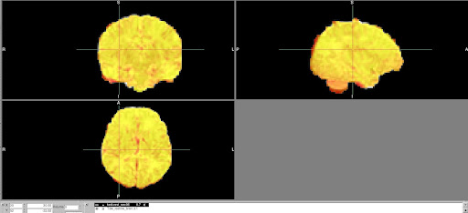

## Troubleshooting anatomical and functional issues in pipeline output images

**Introduction**

Because there are many aspects of infant processing and quality assessment that are new and have yet to be standardized, we occasionally need to perform a deeper quality assessment that requires checking the data in the subject’s processed folder to look at the quality in greater detail than the executive summary may allow. The majority of failures that occur in infant processing are caused by issues in the first stage of the pipeline, *PreFreeSurfer*. The majority of the files generated during this stage can be found under `sub-*/ses-*/files/T1w`, although there are also occasionally informative files located under `sub-*/ses-*/files/T2w`. If you don’t know where to start, it’s usually best to inspect the earliest files first and work forward to determine the original source of the error (for example, it may look like there is a masking issue, but masking issues can also be caused by errors that occur earlier such as during acpc-alignment). As you become more familiar with diagnosing issues, it will be less important to follow these steps, but this is a good place to start. Here is an outline of which files to step through to help identify the issue:

**(1) ACPC Alignment**

The files `T1w_acpc_dc.nii.gz` and `T2w_acpc_dc.nii.gz` have been distortion corrected and ACPC-aligned. Sometimes there are issues with ACPC alignment and the brain is oriented oddly. Below are examples of successful images. ACPC alignment errors are easy to see - the orientation will be starkly different than what’s shown below. If there are ACPC alignment issues, look at the files contained in the ACPC alignment working directory, `T1w/ACPCAlignment`, to determine what the issue might be. One common solution is to manually crop the neck from the raw nifti anatomical files: the ACPC alignment script generally performs this cropping and can crop incorrectly  

**(2) Atlas registration**

To check how well the anatomical images are registered to the atlas, use fslview or other visualization program to overlay **T1w_restore_brain.nii.gz** (under _sub-****/ses-None/files/MNINonLinear_) and **INFANT_MNI_T1_1mm.nii.gz **(/home/groups/brainmri/infant/TEMPLATES_FOLDERS/&lt;age range>) (it’s easiest to see the quality of registration with the subject brain overlaid on the atlas head). Click around to different areas of the brain and make sure that the 2 images are relatively well-registered, particularly around the edges.

**(3) Functional to structural registration**

To check functional to structural registration, overlay the subject’s BOLD image from one of the runs, eg** task-rest_run-*.nii.gz** (under  _sub-****/ses-None/files/MNINonLinear/Results/task-rest_run-*_) on top of **T2w_restore_brain.2.nii.gz** (under _sub-****/ses-None/files/MNINonLinear_). Change the BOLD image color to see it more easily (eg “Red-yellow” color option in fslview) and decrease opacity to 75% or so in order to see how well it is registered to the anatomical image.

