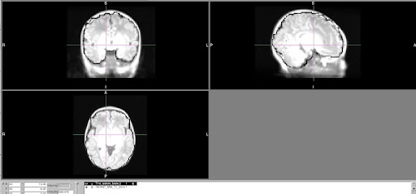

## Troubleshooting anatomical and functional issues in pipeline output images

**Introduction**

Because there are many aspects of infant processing and quality assessment that are new and have yet to be standardized, we occasionally need to perform a deeper quality assessment that requires checking the data in the subject’s processed folder to look at the quality in greater detail than the executive summary may allow. Below are some main “spot checks” to perform if this is the case:

**(1) Atlas registration**

To check how well the anatomical images are registered to the atlas, use fslview or other visualization program to overlay **T1w_restore_brain.nii.gz** (under _sub-****/ses-None/files/MNINonLinear_) and **INFANT_MNI_T1_1mm.nii.gz **(/home/groups/brainmri/infant/TEMPLATES_FOLDERS/&lt;age range>) (it’s easiest to see the quality of registration with the subject brain overlaid on the atlas head). Click around to different areas of the brain and make sure that the 2 images are relatively well-registered, particularly around the edges.

**(2) Functional to structural registration**

To check functional to structural registration, overlay the subject’s BOLD image from one of the runs, eg** task-rest_run-*.nii.gz** (under  _sub-****/ses-None/files/MNINonLinear/Results/task-rest_run-*_) on top of **T2w_restore_brain.2.nii.gz** (under _sub-****/ses-None/files/MNINonLinear_). Change the BOLD image color to see it more easily (eg “Red-yellow” color option in fslview) and decrease opacity to 75% or so in order to see how well it is registered to the anatomical image.

